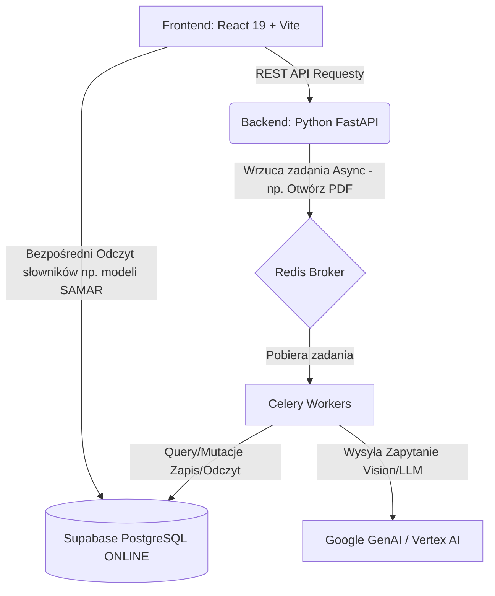

# Architektura Kalkulatora V3

Ten dokument służy jako "mapa systemu", która rozjaśnia i usuwa w całości efekt mglistej "czarnej skrzynki". Celem tego pliku jest pokazanie jak logicznie poszczególne klocki (Frontend, Backend API, Baza Online, AI z Vertex, oraz maszyny kolejkowe Celery) ze sobą rozmawiają.

## 1. Wysokopoziomowy Przepływ Systemu (High-Level Overview)

## 2. Anatomia Poszczególnych Komponentów

### A. Baza Danych (Supabase Hosted/Online)
- **Status:** Zawiera docelowe, cenne produkcyjne i diagnostyczne dane pojazdów. Wszelkie operacje niszczące bazę są tu zablokowane z poziomu AI.
- **Odczyty via Frontend:** React (poprzez bibliotekę np. `@supabase/supabase-js`) sam często czyta tabele asynchronicznie, aby szybko uładować listę dropdown marek, lub modele `samar_classes`. 
- **Zapisy:** Część modyfikacji (np. zmiana struktury) podlega wymogowi posiadania obok Backend API i migracjom w folderze `supabase/migrations`. Pamiętej, bazę traktuj tutaj jako "Ultimate Source of Truth" - nie koduj w systemie "na twardo" nazw czy mnożników dla jakichś brandów (np BMW). Jeśli dodajemy logikę liczącą dla marki, trzymaj to uzależnione od rekordu w DB w dedykowanej tabelce parametrów.

### B. Backend API (FastAPI - Python 3.12)
- **Lokalizacja:** `/backend`, głównym wejściem do serwera jest plik uploaderze `main.py` oraz uruchamiarka `run_dev.py`.
- **Rola:** Zarządza logiką biznesową przepływu informacji pomiędzy panelem administracyjnym a usługami, posiada endpointy chronione oraz endpointy rzucające zapytania na "matrixy kalkulacyjne". 
- **Zasady pisania kodów (DoD):** Ścisłe typowanie (Modele `pydantic`), asynchroniczne odpytywania funkcji (Używaj async/await) aby nie zamrażać głównej pętli Event Loop! Narzędziem pilnującym porządku jest tu `ruff` oraz `mypy`.

### C. Background Jobs / Złożone Operacje Matematyczne (Celery & Redis)
- **Cel:** Systemy webowe (FastAPI) nie radzą sobie dobrze, jeśli powieszki na endpoincie uderzenie do sztucznej inteligencji, która będzie skrupulatnie mulić 30s czytając PDF z wyciągiem oferty cenowej samochodu, lub gdy matrix liczy tablice wielowymiarowe dla ubezpieczeń.
- **Workflow / Flow zadań Asynchronicznych:**
  1. Frontend React (Plik typu *DocumentCard.tsx*) wyrzuca ciężki plik na Backend.
  2. Backend FastAPI nie mieli go sam w całości i od razu, po upewnieniu się czy jest git i wrzuca Task (Obiekt Zadania) do kolejki trzymanej w *Redis*.
  3. Serwer webowy zwraca frontendowi numerek w postaci ID_Zadania (np. `a04ebf...`). Użytkownik widzi pasek postępu (Stepper z krokami).
  4. Niewidoczny *Worker Celery* zżera zadanie z Redis i dzwoni do np. *Google Gemini*. 
  5. Po wypluciu z Gemini paczki JSON, worker dodaje to do Supabase z flagą completed.
  6. Frontend React cały czas wysyłający leciutkie pyka "Zrobione?" dowiaduje się i wczytuje nową estymację na widoku!

### D. Frontend Workspace (React 19 + TypeScript)
- W folderze `/frontend`. Posiada architekturę hooków. Od strony CSS używany jest Tailwind CSS v4 wraz z material/ui, gwarantując wygląd i rygor. Routing to silnik React-Router.
- Pamiętaj, każda większa zmiana nazw endpointu API wymaga wejścia w pliki `.ts` i zaadresowania zmiany na poziomie frontu.

## 3. Ważne Zależności w Architekturze / "Ruchy Systemowe" / Efekt Domina

### A. Zmiana Modelu Danych w bazie (Supabase -> Backend -> Frontend)
W tym projekcie dodanie nowej kolumny to nie tylko skrypcik w bazie. Wykonujesz "Rysowanie linii w poprzek systemu":
1. **DB:** Dodajesz migrację SQL w `supabase/migrations`.
2. **Backend:** Rejestrujesz je/Powiększasz Modele wejścia/wyjścia "Pydantic" (Często plik model.py dla ekstrakcji lub specyfikacji parametru). Backend też musi rozumieć nowy węzeł.
3. **Frontend:** Lecisz do pliku `frontend/src/types.ts` (albo adekwatnego) zdefiniować tę kolumnę dla Typescript by tsc nie wywalił byka!
4. **UI View:** Upewniasz się, że komponent mapowania dodaje nowy klawisz obok starego (jeśli zmieniano tabelkę konfiguracyjną).
Zaniedbanie jednej z tych warstw skutkuje wysadzeniem frontendu - **dlatego testuj w całości**.

### B. Przewidywane Kalkulacje Reverse Search (Odwrócone kalkulacje)
Mechanizm ten (czyli pobieranie cenników po marży) w kalkulatorze v3 opiera się o cache. Błędnym jest na siłę pisanie funkcji, która całą logikę odpala sama. Rzeczywisty strumień odwróconego wyszukiwania ciągnie **Cenę Bazową (Bez marży handlowej)** prosto z zapisanego wyniku ciężkiego kalkulatora przeliczeń w Tabeli `ltr_kalkulacje`, bądź buforze. Dopiero czysty i gotowy na widoku React przelicza UI i budowę frontową - dodając do tej ceny dynamiczny rabat czy dopis (Wzór: `price / (1 - margin)`).

> Dokument ten wspólnie z restrykcją pliku GEMINI.md zamyka proces obaw i traktowania powiązań narzędziami po macoszemu. Wskazuje AI i Nowym developerom drogę pracy tak by projekt był przewidywalny!
